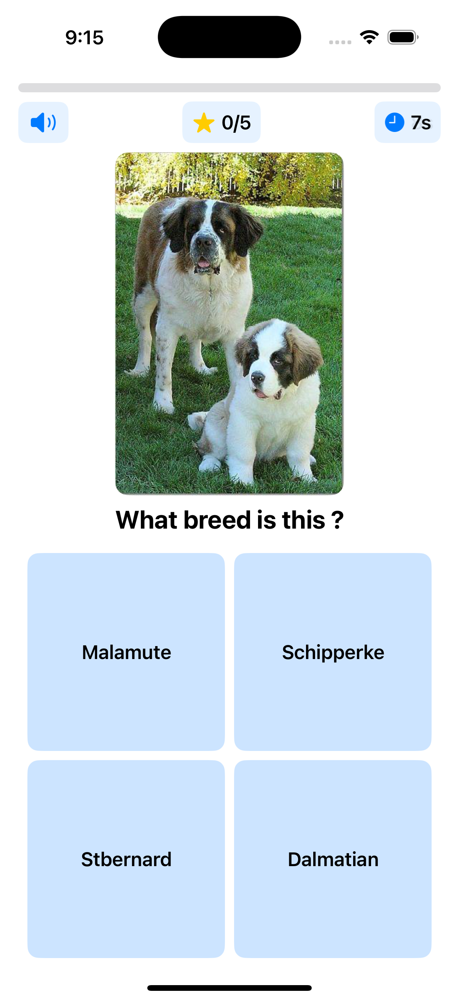

# 🐕 Dog Breed Quiz App

|||||
|--|--|--|--|
| | | ||


An interactive iOS quiz game inspired by [kahoot](https://kahoot.com/) that tests your knowledge of dog breeds. The app fetches random dog images and challenges players to identify the correct breed from multiple choices.

## ✨ Features

- 🎮 Customizable quiz length (5, 10, 15, or 20 questions)
- 🎯 Multiple choice quiz format
- ⏱️ 10-second timer for each question
- ✅ Immediate feedback with correct/wrong indicators
- 📊 Score tracking and percentage calculation
- 🎵 Sound effects and haptic feedback
- 🏆 End-game performance score

## 🎮 How to Play

1. Launch the app
2. Choose the number of breeds you want to guess (5-20)
3. For each question:
   - You have 10 seconds to identify the breed
   - Select from four possible answers
   - Get immediate feedback on your choice
4. After completing all questions:
   - View your final score
   - See your performance rating (emoji based)
   - Option to play again

## 🚀 Getting Started

### Prerequisites

- Xcode 15.0 or later
- iOS 17.0 or later
- Swift 5.9 or later

### Installation

1. Clone the repository:
```bash
git clone https://github.com/NyashaNziramasanga/DogBreedQuizApp.git
```

2. Open the project in Xcode:
```bash
cd DogBreedQuizApp
open DogBreedQuiz.xcodeproj
```

3. Build and run the project in Xcode using ⌘R or the play button.

## 📱 App Structure

- `ContentView.swift` - Main game interface
- `DogAPI.swift` - API integration and networking
- `DogQuizViewModel.swift` - Game logic and state management
- `AnswerButton.swift` - Custom button component
- `ScoreDialog.swift` - End game score display
- `StartDialog.swift` - Game configuration screen

## 🛠️ Built With

- **[SwiftUI](https://developer.apple.com/swiftui/)** - Modern declarative UI framework
- **[AVFoundation](https://developer.apple.com/av-foundation/)** - Audio playback and effects
- **[Dog CEO API](https://dog.ceo/dog-api/)** - Dog image and breed data
- **[Combine](https://developer.apple.com/documentation/combine)** - Reactive programming
- **[Swift Concurrency](https://docs.swift.org/swift-book/documentation/the-swift-programming-language/concurrency/)** - Async/await for network calls

